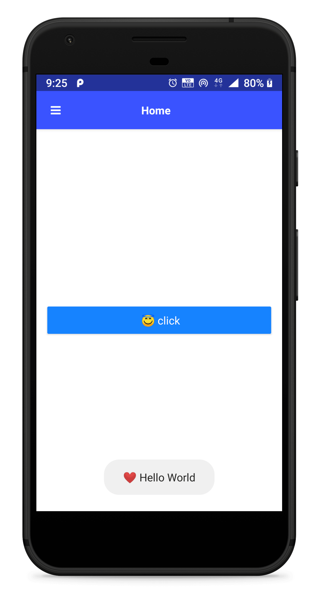
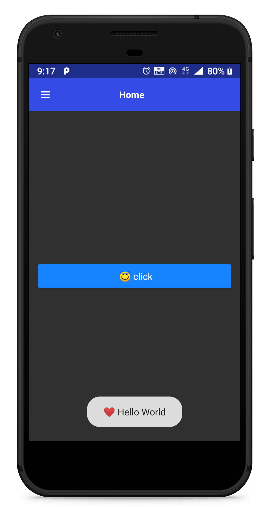

# Nativescript Android Toast


[](https://travis-ci.com/iamabs2001/nativescript-chrome-tabs)


## Installation:
``` tns plugin add nativescript-android-toast ```

<hr>

## API (Methods)

```javascript
MakeToast(text : String, duration : "long" or "short");
```
<hr>

## API (Properties)
| Property | Type | Require |Description |
| --- | --- | --- | --- |
| text | String | - [x] | Text you want to toast |
| duration | String | - [ ] | "long" or "short" duration |

<hr>

## Demo

| Demo 1 | Demo 2 |
| ----------- | ----------- |
|  |  |


<hr>

## Usage

### TypeScript

```typescript
import Toast from "nativescript-android-toast";

showToast() {
    Toast.MakeToast("Hello Typescript","short");
}
```

<hr>

```html
<Button text="click" (tap)="showToast();">
```

<hr>

### JavaScript

```javascript
var Toast = require("nativescript-android-toast");

showToast() {
    Toast.MakeToast("Hello Javascript","long");
}
```

<hr>

https://developer.android.com/reference/android/widget/Toast